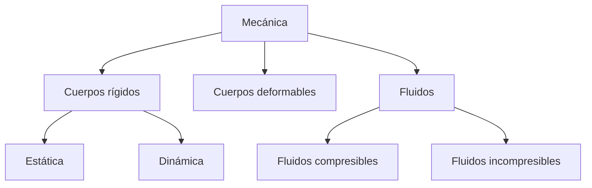

## ¿Qué es la estática?

Es la parte de la mecánica que estudia a los cuerpos en espato de reposo o equilibrio dinámico en cuerpos rígidos

```mermaid
graph TB
A[Mecánica]
B[Cuerpos rígidos]
C[Cuerpos deformables]
D[Fluidos]
B1[Estática]
B2[Dinámica]
D1[Fluidos compresibles]
D2[Fluidos incompresibles]

A-->B
A-->C
A-->D

B-->B1
B-->B2

D-->D1
D-->D2

```

## Momento central

