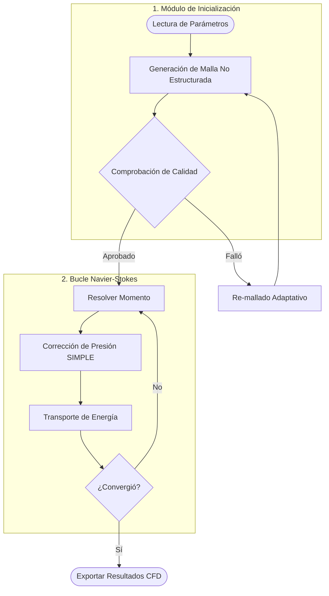
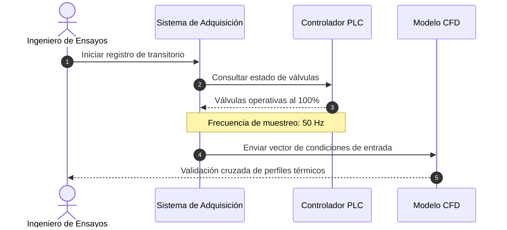
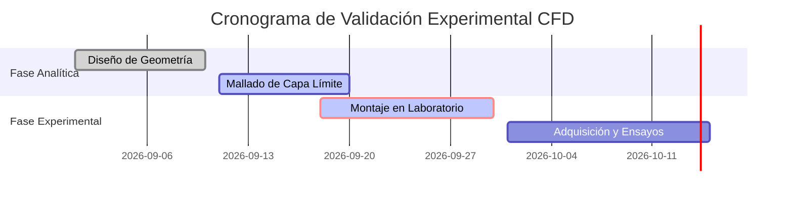

# 1. Fundamentos y Formulación Matemática

El modelado numérico de fenómenos convectivos requiere resolver las ecuaciones de Navier-Stokes para flujo incompresible con propiedades variables. La formulación diferencial de conservación de cantidad de movimiento y energía rige la distribución del campo de velocidades:

$$
\rho \left( \frac{\partial \mathbf{u}}{\partial t} + \mathbf{u} \cdot \nabla \mathbf{u} \right) = -\nabla p + \mu \nabla^2 \mathbf{u} + \rho \mathbf{g} \tag{1}
$$

Donde $\mathbf{u} = (u, v, w)$ representa el vector velocidad en coordenadas cartesianas, $p$ la presión estática, $\rho$ la densidad del fluido en $\text{kg/m}^3$ y $\mu$ la viscosidad dinámica. La ecuación de transporte térmico se define como:

$$
\rho c_p \left( \frac{\partial T}{\partial t} + \mathbf{u} \cdot \nabla T \right) = k \nabla^2 T + \Phi \tag{2}
$$

## 1.1 Jerarquía Tipográfica y Énfasis Cruzados

En este segmento se evalúa la prosa extendida. Es indispensable comprobar texto en **negrita de alto impacto**, *cursiva formal*, combinaciones en ***negrita cursiva***, términos con <del>tachado correctivo</del> y fragmentos de `código inline` insertados en la oración sin alterar el interlineado base.

### 1.1.1 Subnivel Profundo H3
El análisis de malla requiere particionado adaptativo en zonas de capa límite.

#### 1.1.1.1 Subnivel Detallado H4
La discretización espacial de segundo orden minimiza la difusión numérica.

##### Nivel Complementario H5
Condiciones de frontera tipo Dirichlet en las paredes sólidas del ducto.

###### Nivel Mínimo H6
Tolerancia residual de convergencia establecida en $10^{-6}$.

> Las normas formales de publicación técnica exigen que las citas extensas que excedan las cuarenta palabras se compongan en un párrafo independiente, sin comillas iniciales, aplicando una sangría homogénea en el margen izquierdo para distinguirlas con total nitidez del cuerpo del texto regular.

---

# 2. Callouts Estándar de Documentación

> [!note] Nota Informativa
> Los coeficientes convectivos fueron calculados empleando la correlación de Dittus-Boelter para flujo turbulento completamente desarrollado en conductos circulares.

> [!tip] Recomendación de Malla
> Se sugiere mantener un valor de $y^+ < 1$ en la primera celda adyacente a la pared para capturar la subcapa viscosa sin recurrir a funciones de pared empíricas.

> [!warning] Advertencia de Divergencia
> El incremento abrupto del número de Courant ($\text{CFL} > 2.0$) durante los transitorios iniciales puede desestabilizar el algoritmo de acoplamiento de presión y velocidad (SIMPLE).

> [!danger] Parámetro Crítico
> No exceder la temperatura límite de película de $450\ \text{K}$ para evitar la degradación térmica del fluido caloportador en los ensayos experimentales.

---

# 3. Tabulación Experimental y Métricas

A continuación se registran las lecturas térmicas en régimen cuasiestacionario:

| Punto | $T_{\text{in}} (\text{K})$ | $T_{\text{out}} (\text{K})$ | Caudal ($\text{m}^3/\text{h}$) | $\Delta P (\text{kPa})$ | Eficiencia ($\eta$) |
| :---: | :---: | :---: | :---: | :---: | :---: |
| **01** | 293.15 | 345.20 | 1.25 | 12.4 | 0.884 |
| **02** | 293.15 | 358.80 | 1.80 | 24.1 | 0.862 |
| **03** | 293.15 | 371.10 | 2.45 | 41.8 | 0.835 |

* [x] Calibración de termopares tipo K bajo norma ASTM E220.
* [x] Purgado del circuito hidráulico antes del ensayo a plena carga.
* [ ] Extracción de datos con muestreador a 100 Hz.

---

# 4. Código Fuente y Diagramas Vectoriales

A continuación se implementa el solver de relajación en Python:

```python
import numpy as np

def resolver_conduccion_2d(nx: int, ny: int, max_iter: int = 1000, tol: float = 1e-5):
    """Resuelve la ecuación de Laplace 2D por diferencias finitas."""
    T = np.zeros((nx, ny))
    T[-1, :] = 100.0  # Condición de frontera superior caliente
    
    for it in range(max_iter):
        T_old = T.copy()
        T[1:-1, 1:-1] = 0.25 * (T[2:, 1:-1] + T[:-2, 1:-1] + T[1:-1, 2:] + T[1:-1, :-2])
        if np.max(np.abs(T - T_old)) < tol:
            break
            
    return T, it

```







```

---

### Paso 2: Crear el Mapeador y Expansor de Schemas

Para que la exportación permita **crear nuevos temas con su propio ID y nombre legible sin sobreescribir los existentes**, crearemos una utilidad modular en **`src/utils/themePresetsManager.ts`**:

```typescript
// src/utils/themePresetsManager.ts

export interface PresetPayload {
  category: 'estilosBase' | 'plantillasImpresion' | 'caratulas' | 'componentes' | 'diagramasMermaid';
  presetKey: string;
  presetData: any;
}

/**
 * Clona una estructura de datos existente asignando una nueva clave y nombre identificador.
 */
export function cloneAndRegisterPreset(
  targetCategoryDict: Record<string, any>,
  newKey: string,
  newData: any
): Record<string, any> {
  const cleanKey = newKey
    .trim()
    .toLowerCase()
    .replace(/[^a-z0-9_-]/g, '-');

  return {
    ...targetCategoryDict,
    [cleanKey]: {
      ...newData,
      id: cleanKey
    }
  };
}

```