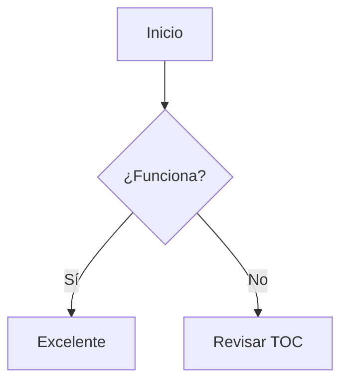
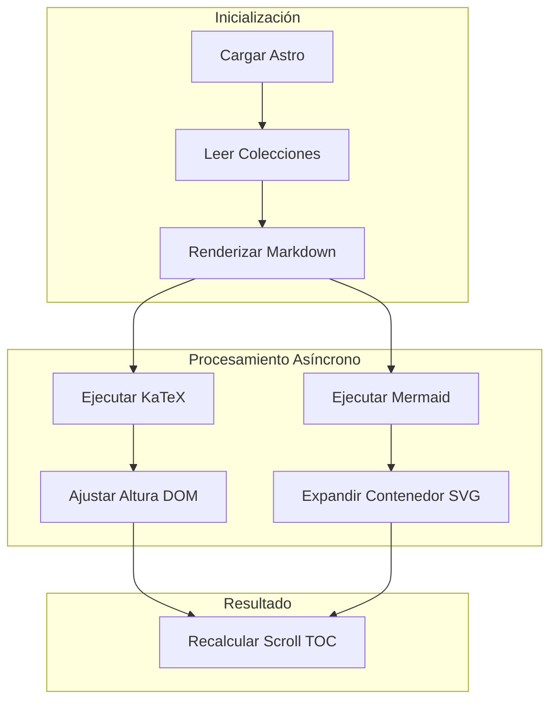

# Archivo Maestro de Diagnóstico del Sistema

Este documento está diseñado específicamente para poner a prueba el **TOC (Índice)**, el comportamiento del scroll por anclajes (`#`), el renderizado asíncrono de Mermaid, KaTeX y la estabilidad general del layout.

---

## 1. Encabezados y Casos Límite del TOC

### 1. Numeración inicial (Prueba de IDs numéricos)
Los encabezados que empiezan con números suelen generar conflictos en los selectores del DOM si no se escapan correctamente.

#### 1.1 Subnivel profundo con espacios y tildes
Verifica si al hacer clic en este subtítulo desde el índice lateral el scroll se posiciona exactamente respetando el header fijo.

---

## 3. Diagramas Mermaid (Cortos y Largos)
Mermaid modifica el DOM de manera asíncrona expandiendo contenedores, lo que pone a prueba la sincronización del `IntersectionObserver` del TOC.

### 3.1 Mermaid Corto (Flujo simple)


### 3.2 Mermaid Largo con Subgraphs (Alto impacto asíncrono)



---

## 4. Tablas (Con y sin Ecuaciones)

### 4.1 Tabla Simple (Sin Ecuaciones)

| Componente | Estado | Prioridad |
| --- | --- | --- |
| Sidebar Izquierdo | Activo | Alta |
| Panel Derecho | Activo | Media |
| Modal Global | Unificado | Alta |

### 4.2 Tabla Compleja (Con Expresiones Matemáticas)


---

## 5. Bloques de Código y Callouts de Obsidian

### 5.1 Bloque de Código con Botón Copiar

```typescript
// Script de prueba para verificar el botón copiar y el resaltado
function probarSistema(): boolean {
    console.log("Sistema de diagnóstico activo");
    return true;
}

```

### 5.2 Callouts de Advertencia y Notas

> [!info] Nota de Prueba
> Este callout verifica que los bordes izquierdos y los fondos pasteles no interfieran con los márgenes de lectura del artículo.

> [!warning] Advertencia de Carga
> Si este bloque de texto se desplaza correctamente al hacer clic en su sección correspondiente en el índice, el offset superior está funcionando bien.

---

## 6. Conclusión del Diagnóstico

Si navegas por todos los puntos de este índice y el menú lateral resalta la sección activa de manera fluida sin saltos extraños ni recortes provocados por el header, el sistema de anclajes y componentes unificados estará completamente estabilizado.
