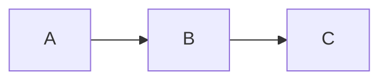

# Cómo usar el Buscador Avanzado

Nuestro buscador no solo lee los títulos de los documentos, sino que permite filtrar los resultados usando comandos rápidos directamente en la barra de búsqueda (o presionando `Cmd+K` / `Ctrl+K`).

**Búsqueda Básica (Títulos)**
Escribe cualquier palabra y el sistema buscará coincidencias en los títulos de tus apuntes.
*Ejemplo:* `javascript` o `apuntes de clase`.

**Filtro por Etiquetas (`#`)**
Encuentra documentos que contengan una etiqueta específica añadiendo el símbolo numeral.
*Ejemplo:* `#backend` mostrará todo lo etiquetado con backend.

**Exclusión de Etiquetas (`-#`)**
Filtra los resultados para **ocultar** documentos que contengan cierta etiqueta. Es muy útil para limpiar los resultados.
*Ejemplo:* `#tutorial -#react` mostrará tutoriales que NO sean de React.

**Filtro por Autor (`@`)**
Si trabajas con múltiples colaboradores o fuentes, busca por el creador del documento.
*Ejemplo:* `@admin` o `@carlos`.

**Búsquedas Combinadas (El modo Dios)**
Puedes mezclar todos los comandos anteriores separados por un espacio para crear filtros ultra precisos.  
*Ejemplo:* `guia #frontend -#css @admin`
*(Traducción: "Busca apuntes que tengan la palabra 'guia' en el título, que tengan la etiqueta 'frontend', que NO tengan la etiqueta 'css', y que estén escritos por 'admin'").*

