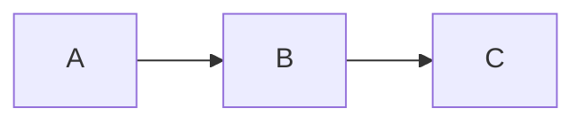

# Bienvenido a tu Espacio Personal de Documentación 🚀

Este repositorio está construido con **Astro**, **Markdown** y **MDX**, estructurado de forma idéntica a un explorador de archivos local para mantener el orden al estilo Obsidian.

## ¿Qué puedes hacer aquí?
* **Navegar por carpetas:** Usa el explorador del panel izquierdo para organizar tus apuntes de forma jerárquica.
* **Consultar el Índice (TOC):** Salta rápidamente entre los subtítulos de la página actual desde la pestaña de índice.
* **Soporte Matemático (KaTeX):** Escribe fórmulas complejas tanto en línea ($a^2 + b^2 = c^2$) como en bloques dedicados.
* **Personalizar la Apariencia:** Cambia entre modo claro/oscuro, ajusta la tipografía (moderno, académico, minimalista) y modifica el ancho de lectura desde el panel de configuración de la derecha.

---

Usa el menú superior para ir a la **Portada** y aprender la guía básica e intermedia sobre cómo escribir tus propios archivos `.md` y `.mdx`.

