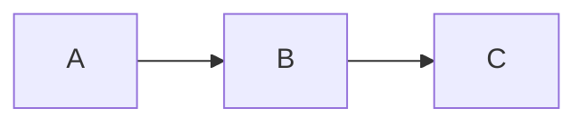

# Guía de Escritura: Markdown y MDX 📖

Esta página te muestra los elementos básicos e intermedios que puedes utilizar para redactar tus apuntes y lograr que este sistema los renderice a la perfección.

## 1. Metadatos (Frontmatter)
Todo documento debe iniciar con un bloque YAML superior para definir su título, fecha, autor y etiquetas de búsqueda:

```yaml
---
title: Título de tu Apunte
date: 2026-09-03
author: "Tu Nombre"
tags: ["etiqueta1", "etiqueta2"]
orden: 2
theme: "academico"
---
```

## 2. Sintaxis Básica de Markdown

Puedes usar texto en **negrita**, *cursiva*, listas ordenadas o desordenadas, y citas:

* Elemento de lista uno.
* Elemento de lista dos con subelementos.


## 3. Matemáticas con KaTeX

Para fórmulas en la misma línea de texto, usa un símbolo de dólar: la velocidad de la luz es . Para bloques matemáticos complejos **en archivos .mdx** , usa siempre el bloque de tipo `math`:


## 4. Componentes Avanzados en MDX (.mdx)

Si cambias la extensión de tu archivo a `.mdx`, puedes combinar HTML/JSX con bloques de Markdown.


💡 Ejemplo de Caja JSX Interactiva

```javascript
const mensaje = "¡Hola mundo!";
console.log(mensaje);
```


