## 1. Flowchart (Diagramas de Flujo con Subgráficos)
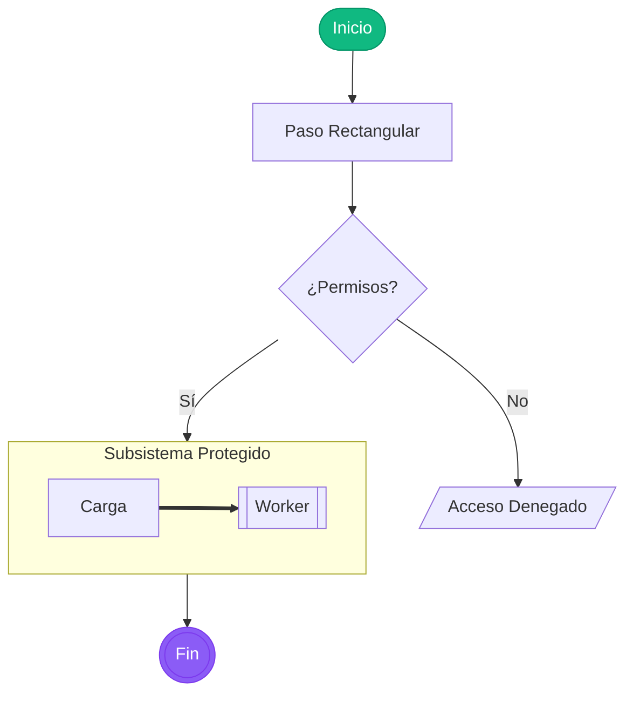

---

## 2. Sequence Diagram (Diagrama de Secuencia con Bucles y Notas)

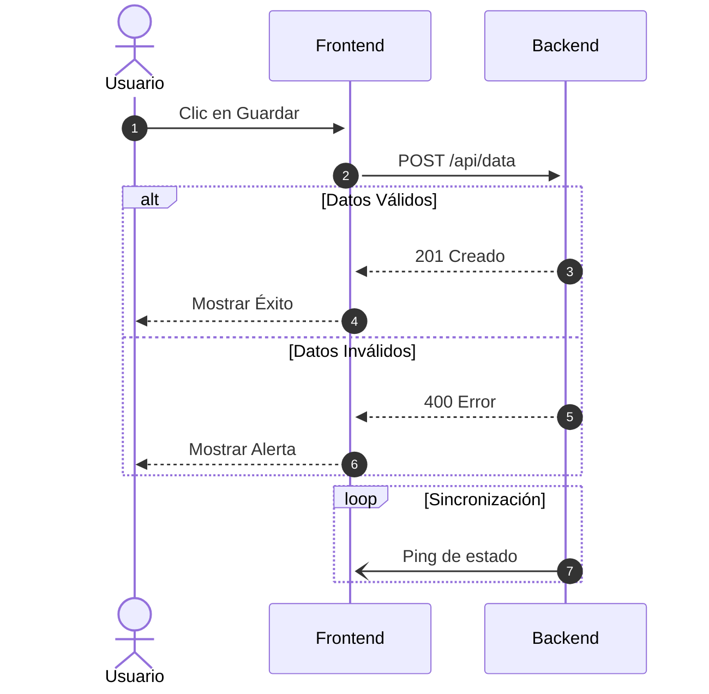

---

## 3. Class Diagram (Diagrama de Clases POO)

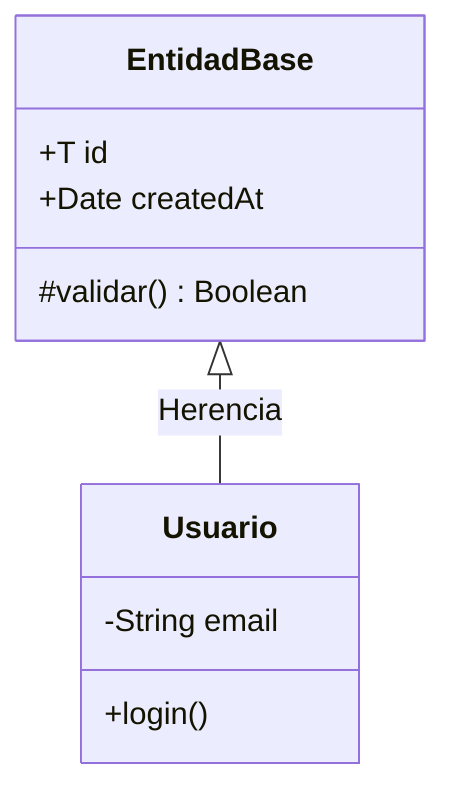

---

## 4. State Diagram (Máquina de Estados con Concurrencia)

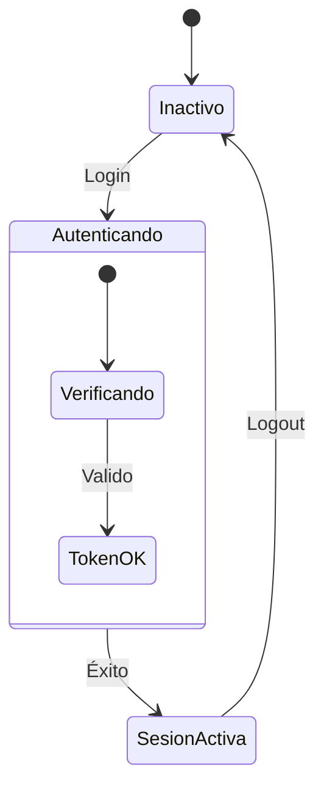

---

## 5. ER Diagram (Entidad-Relación de Base de Datos)

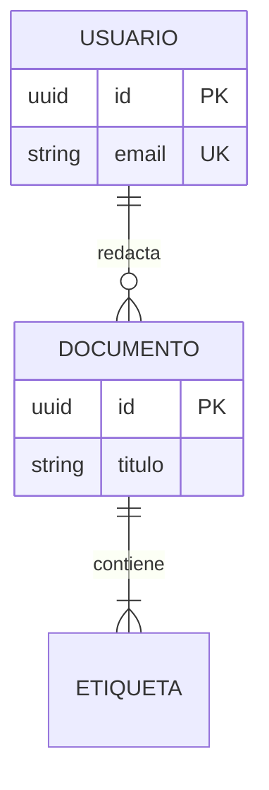

---

## 6. Gantt Chart (Cronogramas de Proyecto)

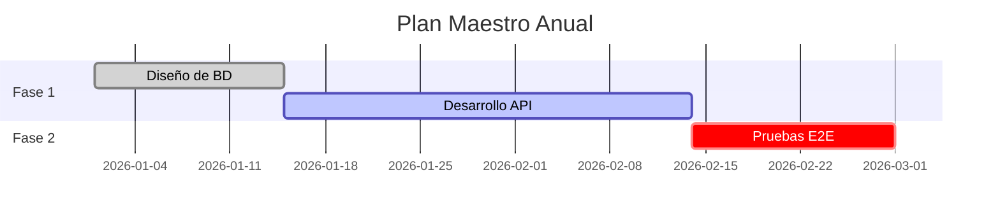

---

## 7. GitGraph (Historial de Ramas Git)

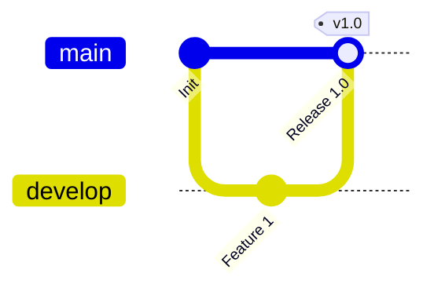

---

## 8. Quadrant Chart (Matriz de Cuadrantes)

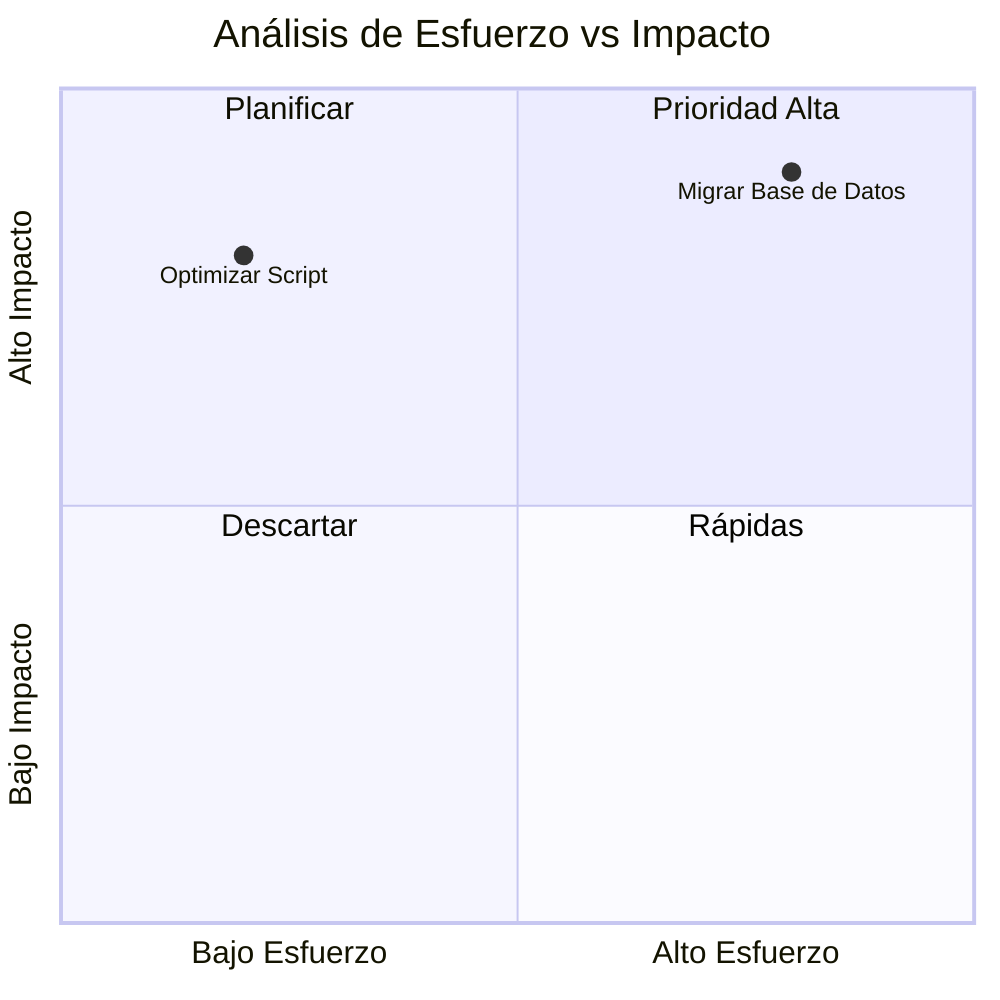

---

## 9. Mindmap (Mapa Mental Jerárquico)

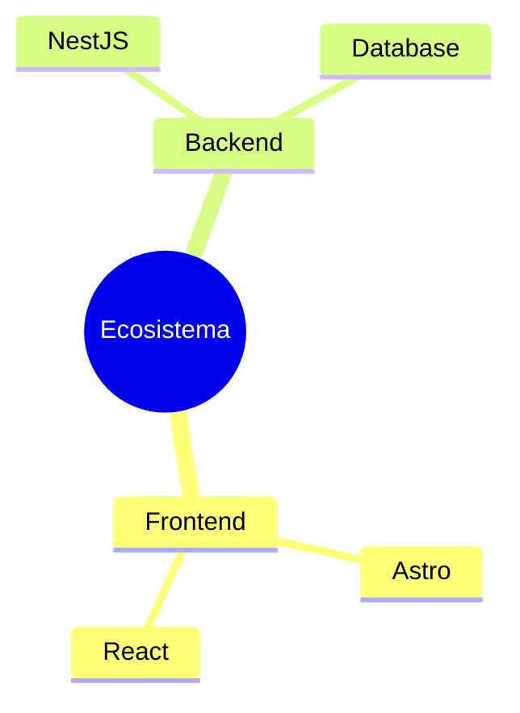

---

## 10. Pie Chart (Gráfico Circular / Pastel)

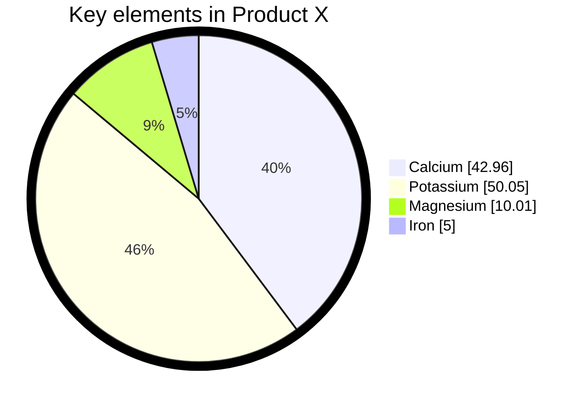

---

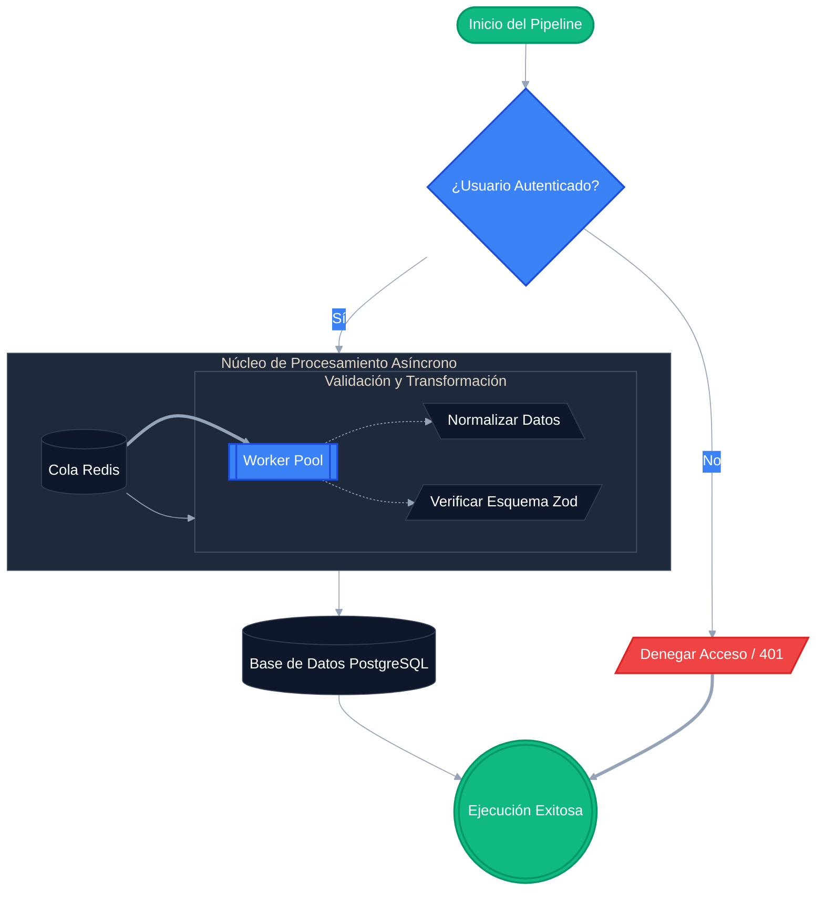

---

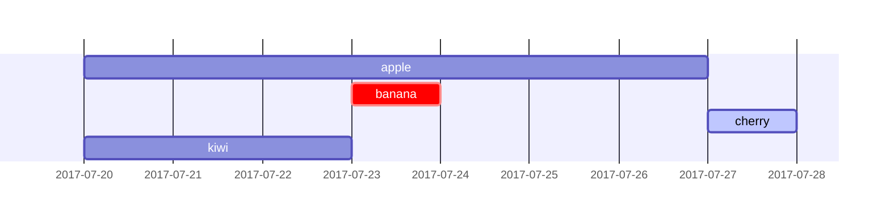
---

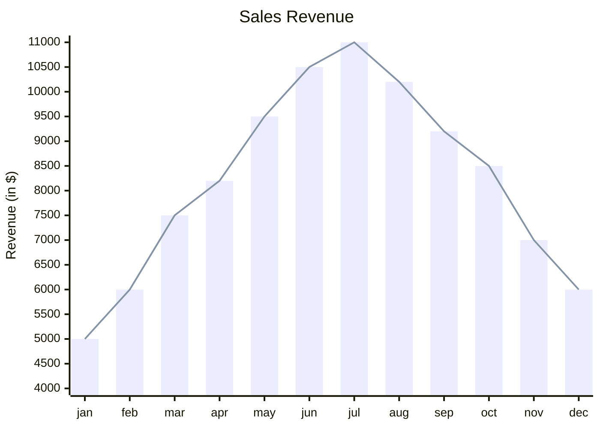

---

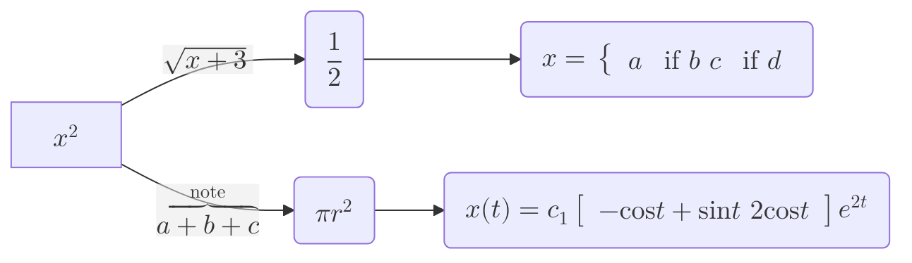

---

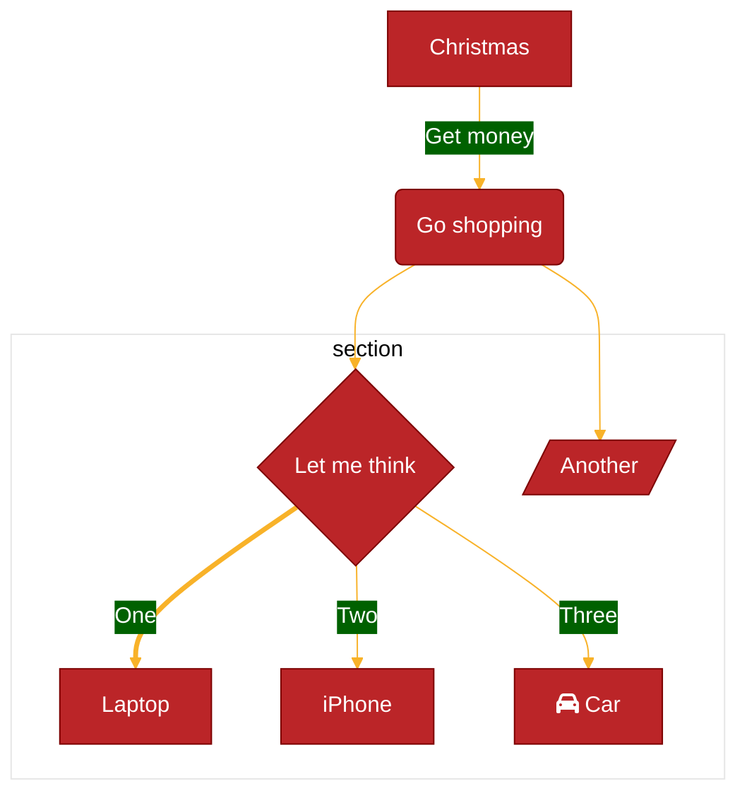
