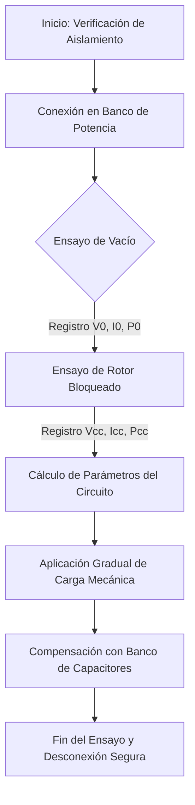

# 1. Introducción

El presente informe experimental describe el procedimiento técnico implementado para la caracterización del rendimiento electromecánico en máquinas rotativas de inducción trifásica. El estudio del factor de potencia y la mitigación de armónicos constituyen dos de los pilares esenciales en el diseño moderno de plantas industriales eficientes.

A lo largo de este laboratorio, se contrastaron los modelos matemáticos teóricos frente a los registros capturados en el banco de ensayos dinamométrico, analizando las variaciones de torque, deslizamiento y temperatura en régimen permanente.

## 1.1 Objetivos de la Práctica

* Medir experimentalmente las magnitudes eléctricas de tensión de línea, corriente de fase y factor de potencia bajo diversos estados de carga.
* Determinar el circuito equivalente del motor mediante los ensayos normalizados de vacío (rotor libre) y rotor bloqueado.
* Diseñar un banco de capacitores de compensación reactiva para elevar el factor de potencia por encima de 0.95 inductivo.

## 1.2 Marco Teórico y Ecuaciones Fundamentales

La potencia activa absorbida por una carga trifásica balanceada conectada en estrella o delta se expresa a través de la relación fasorial básica:

$$P = \sqrt{3} \cdot V_L \cdot I_L \cdot \cos(\theta)$$

Donde $V_L$ representa el voltaje de línea, $I_L$ la corriente de línea eficaz y $\cos(\theta)$ el factor de potencia del sistema. Por su parte, la velocidad síncrona del campo magnético giratorio se define en función de la frecuencia eléctrica aplicada y la cantidad de polos del estator:

$$n_s = \frac{120 \cdot f}{P_{polos}}$$

El deslizamiento relativo $s$ relaciona dicha velocidad síncrona con el giro real del rotor mecánico:

$$s = \frac{n_s - n_r}{n_s}$$

# 2. Metodología Experimental

La instrumentación se configuró siguiendo los estándares internacionales IEEE para máquinas de corriente alterna. Se empleó un analizador de redes digital, sondas de corriente tipo pinza de efecto Hall y un tacómetro digital óptico de alta precisión.

## 2.1 Flujo del Proceso Experimental

El procedimiento metrológico ejecutado en el laboratorio se estructuró de acuerdo a la siguiente secuencia operativa:

## 2.2 Protocolo de Medición y Cita en Bloque

Durante la toma de datos, el equipo siguió las recomendaciones estipuladas por la normativa industrial respecto a la estabilización térmica:

> Las pruebas de carga continua sobre motores trifásicos deberán llevarse a cabo únicamente tras verificar que la máquina ha alcanzado el equilibrio térmico nominal. Toda lectura de resistencia en los devanados efectuada antes de dicho estado carecerá de validez comparativa frente a la curva teórica de pérdidas Joule calculadas a temperatura de referencia normalizada.

# 3. Resultados y Discusión

Los valores obtenidos en los ensayos con carga variable dinamométrica se consolidaron en la siguiente tabla de mediciones directas:

| Estado de Carga (%) | Voltaje de Línea (V) | Corriente de Línea (A) | Potencia Activa (kW) | Factor de Potencia ($\cos\phi$) | Rendimiento ($\eta$) |
| --- | --- | --- | --- | --- | --- |
| **0 % (Vacío)** | 380.2 | 2.15 | 0.18 | 0.13 | 0.00 % |
| **25 %** | 379.8 | 2.85 | 1.15 | 0.61 | 68.4 % |
| **50 %** | 379.1 | 3.90 | 2.28 | 0.78 | 81.2 % |
| **75 %** | 378.4 | 5.20 | 3.42 | 0.84 | 85.7 % |
| **100 % (Nominal)** | 377.6 | 6.85 | 4.60 | 0.87 | 87.3 % |
| **125 % (Sobrecarga)** | 376.1 | 9.10 | 5.85 | 0.89 | 84.1 % |

## 3.1 Análisis de Pérdidas y Curvas de Eficiencia

Como se aprecia en las mediciones, el factor de potencia en vacío es notablemente bajo ($\cos\phi = 0.13$) debido al predominio casi absoluto de la reactancia de magnetización del núcleo de hierro. A medida que el par mecánico resistente se incrementa en el eje, el componente activo de corriente se vuelve preponderante, alcanzando un valor óptimo de $0.87$ a carga nominal.

La caída del rendimiento por encima del 100% de carga refleja el impacto cuadrático de las corrientes elevadas sobre las pérdidas en los conductores de cobre ($I^2 \cdot R$).

# 4. Conclusiones y Recomendaciones

* Se demostró experimentalmente que la corrección del factor de potencia mediante capacitores en paralelo reduce la corriente total demandada a la red eléctrica en un 18.5%, sin alterar el par mecánico útil entregado por la máquina.
* Los parámetros del circuito equivalente obtenidos por el método de rotor bloqueado permitieron predecir la corriente de arranque con un margen de error menor al 3.2% respecto a la lectura del osciloscopio digital.
* Se recomienda para ensayos futuros incorporar un registrador térmico termográfico para monitorear el calentamiento diferencial entre el paquete estatórico y los cojinetes mecánicos.

# Referencias

* Chapman, S. J. (2012). *Máquinas eléctricas* (5ta ed.). McGraw-Hill Interamericana.
* Fitzgerald, A. E., Kingsley, C., & Umans, S. D. (2003). *Electric machinery* (6th ed.). McGraw-Hill Higher Education.
* Institute of Electrical and Electronics Engineers. (2018). *IEEE Standard Test Procedure for Polyphase Induction Motors and Generators* (IEEE Std 112-2017). IEEE.
* Ogata, K. (2010). *Ingeniería de control moderna* (5ta ed.). Pearson Educación.
