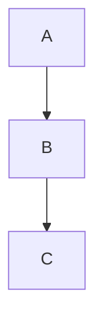

# Guía Completa de Markdown (Parte 1)
Guía práctica de todo lo que Markdown puede hacer de forma nativa o ampliamente soportada.

---

# 1. Encabezados

Se usan para estructurar el documento.

# Título H1
## Título H2
### Título H3
#### Título H4
##### Título H5
###### Título H6

---

# 2. Texto básico

**Negrita**

*Cursiva*

***Negrita y cursiva***

~~Texto tachado~~

Subíndice: H~2~O  
Superíndice: X^2^

---

# 3. Párrafos y saltos de línea

Markdown separa párrafos con una línea en blanco.

Este es un párrafo.

Este es otro párrafo.

Salto de línea manual  
usando dos espacios al final.

---

# 4. Citas

> Esta es una cita.
>
> Puede tener múltiples líneas.

Cita anidada:

> Nivel 1
>> Nivel 2

---

# 5. Listas

## Lista no ordenada

- Elemento
- Elemento
  - Sub elemento
  - Sub elemento

## Lista ordenada

1. Paso uno
2. Paso dos
3. Paso tres

## Lista de tareas

- [x] Completado
- [ ] Pendiente

---

# 6. Líneas divisorias

---

***

___

---

# 7. Enlaces

Enlace simple:
[Ir a OpenAI](https://openai.com)

Enlace con título:
[OpenAI](https://openai.com "Sitio oficial")

Enlace automático:
https://openai.com

---

# 8. Imágenes

Imagen básica:

<!--  -->

Imagen con título:

<!--  -->

---

# 9. Código

## Código inline

Usa `codigo` dentro de una línea.

## Bloques de código

```python
print("Hola mundo")
````

```cpp
#include <iostream>
using namespace std;
int main() {
  cout << "Hola";
}
```

---

# 10. Tablas

|Lenguaje|Uso|
|---|---|
|Python|Ciencia|
|C++|Sistemas|

Alineación:

|Izquierda|Centro|Derecha|
|:--|:-:|--:|
|texto|texto|texto|

---

# 11. Matemáticas (LaTeX)

Inline:

$a^2 + b^2 = c^2$

Bloque:

$$  
\int_0^1 x^2 dx  
$$

---

# 12. Diagramas Mermaid



---

# 13. Comentarios

No se muestran en el render: %%dasdasd%%

---

# 14. Escapar caracteres especiales

*Esto no es cursiva*

---

# 15. Emojis (si el motor lo permite)

😀 😎 🚀

# Guía Completa de Markdown (Parte 2)
Markdown extendido con HTML y estructuras avanzadas para documentación académica y web.

---

# 16. HTML dentro de Markdown

Markdown permite usar HTML directamente.

<div>
Esto es un contenedor HTML dentro de Markdown.
</div>

Puedes usar clases para aplicar CSS externo:

<div class="caja">
Contenido destacado
</div>

---

# 17. Columnas (layout real)

## Dos columnas

<div class="columnas-2">
<div>

Contenido izquierda

</div>
<div>

Contenido derecha

</div>
</div>

## Tres columnas

<div class="columnas-3">
<div>Columna 1</div>
<div>Columna 2</div>
<div>Columna 3</div>
</div>

---

# 18. Bloques desplegables

<details>
<summary>Ver contenido</summary>

Texto oculto que aparece al hacer clic.

</details>

Útil para definiciones largas o demostraciones matemáticas.

---

# 19. SVG inline

Gráfico vectorial dentro del documento.

<svg width="120" height="120">
  <circle cx="60" cy="60" r="50" stroke="black" fill="blue"/>
</svg>

SVG inline es portable y no depende de archivos externos.

---

# 20. Tablas avanzadas con HTML

<table>
<tr>
<th>Lenguaje</th>
<th>Tipo</th>
</tr>
<tr>
<td>Python</td>
<td>Ciencia</td>
</tr>
<tr>
<td>C++</td>
<td>Sistemas</td>
</tr>
</table>

---

# 21. Bloques semánticos útiles

## Caja de información

<div class="info">
Concepto importante.
</div>

## Advertencia

<div class="warning">
Esto requiere atención.
</div>

---

# 22. Front-matter (metadata)

Define información estructural del documento.

---
title: "Apuntes"
tema: "oscuro"
categoria: "backend"
tags: ["c++", "python"]
---

Esta información no se muestra, pero la aplicación puede leerla.

---

# 23. Separación contenido / presentación

Markdown describe el contenido.

CSS controla apariencia.

Aplicación web controla comportamiento.

Ejemplo conceptual:

Contenido → Markdown  
Estilo → CSS  
Render → Aplicación

---

# 24. Buenas prácticas para documentación académica

✔ usar encabezados jerárquicos  
✔ evitar estilos inline  
✔ usar clases semánticas  
✔ mantener contenido portable  
✔ usar LaTeX para fórmulas  
✔ usar SVG para diagramas simples  

---

# 25. Lo que Markdown NO es

Markdown no es:

- un lenguaje de programación
- un sistema de componentes
- un framework
- un motor de animación

Markdown es contenido estructurado.

---

# FIN PARTE 2
Markdown completo: estructura + HTML + metadata.

