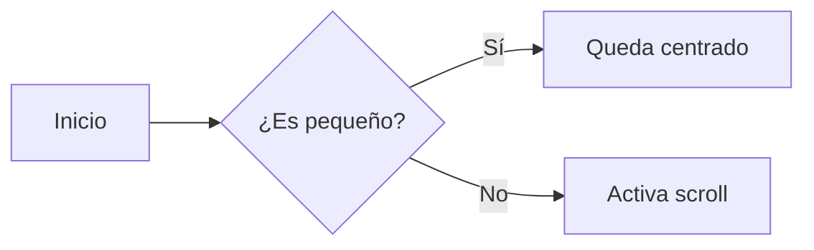
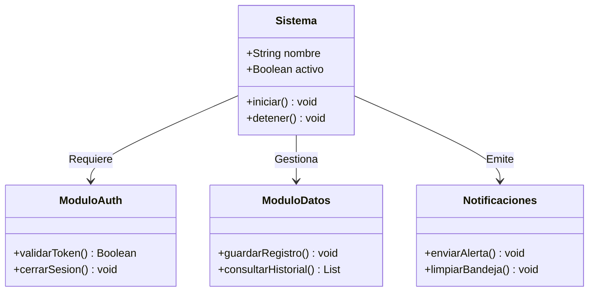
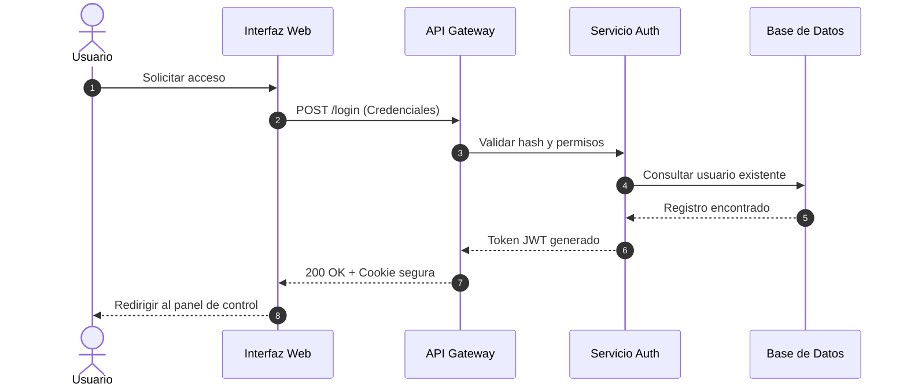
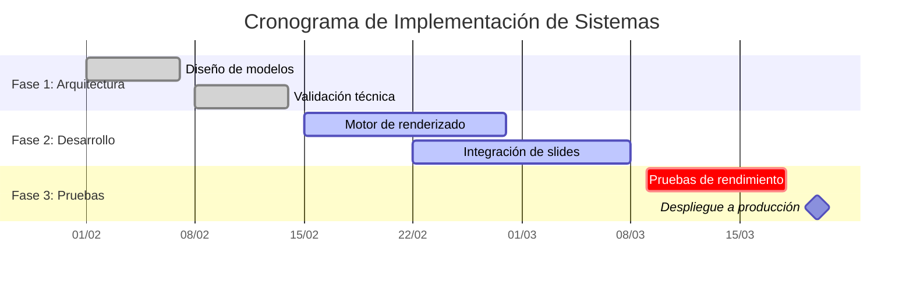
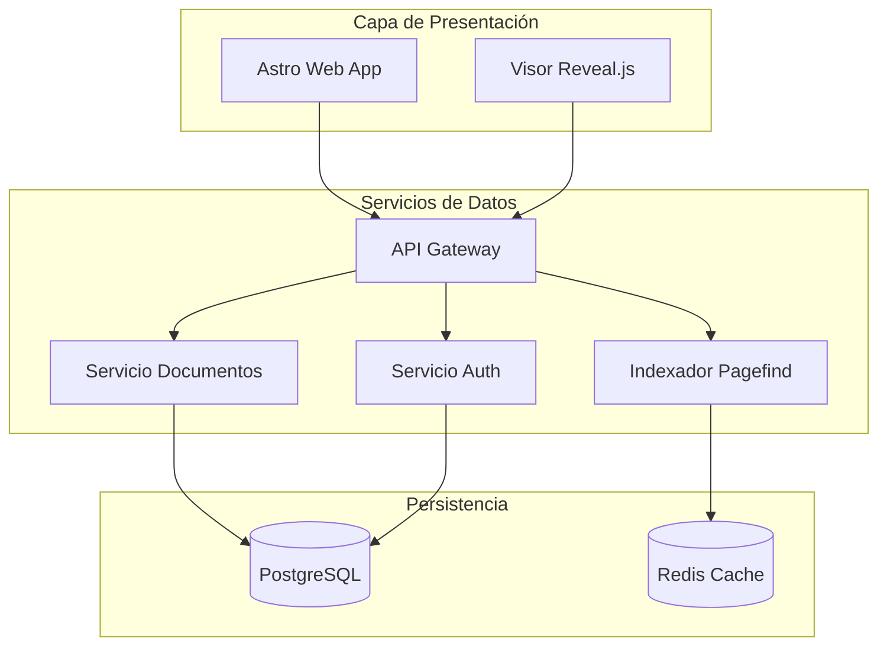

# Mermaid en Diapositivas
### Guía de Uso y Comportamiento del Scroll

Presiona la **Flecha Derecha** o la **Barra Espaciadora** para comenzar.

---

## 1. ¿Cómo funciona el contenedor?

En la vista normal de lectura, el diagrama se adapta a la columna de texto. En cambio, en los **Slides**:

* El diagrama se monta dentro de un **recuadro oscuro centrado**.
* Su tamaño está acotado a un máximo de **90vw de ancho** y **55vh de alto**.
* **El scroll es 100% automático**: si el diagrama desborda, la barra aparece sola.

--

### Ejemplo 1: Diagrama Simple (Sin Scroll)

Cuando el diagrama es pequeño, cabe perfectamente y **no muestra barras de scroll**:

---

## 2. Scroll Vertical (Diagramas Altos)

Si el diagrama crece hacia abajo (como árboles, flujos verticales o diagramas de clases), supera los `55vh` de la ventana.

* **Resultado:** Aparece la barra de scroll **vertical** a la derecha.
* Puedes desplazarte con la rueda del ratón sin cambiar de diapositiva.

--

### Ejemplo 2: Diagrama de Clases Vertical

---

## 3. Scroll Horizontal (Diagramas Anchos)

Si el diagrama crece a lo ancho (diagramas de secuencia extensos, Gantt o flujos largos), supera el ancho del marco.

* **Resultado:** Aparece la barra de scroll **horizontal** en la parte inferior.
* Puedes desplazarte horizontalmente arrastrando la barra o usando Shift + rueda del ratón.

--

### Ejemplo 3: Diagrama de Secuencia Extenso

--

### Ejemplo 4: Diagrama Gantt Extenso

---

## 4. Scroll Bidireccional (Diagramas Gigantes)

Si un diagrama combina subgrafos anchos y múltiples niveles de altura, el marco activará **ambas barras de scroll** (horizontal y vertical).

--

### Ejemplo 5: Arquitectura Compleja

---

## 5. Resumen de Buenas Prácticas

1. **Usa directivas si necesitas un tamaño puntual:**
* `%%width: 1200px%%` para forzar un ancho mínimo.

* `%%height: 400px%%` para limitar o expandir la altura.

2. **Navegación en la presentación:**
* La rueda del ratón dentro del recuadro hace scroll en el diagrama sin saltar de diapositiva.

* Para pasar a la siguiente diapositiva, usa las **flechas del teclado** o haz scroll fuera del marco.

---

### Cómo probarlo:
1. **Modo Lectura:** Ve a tu explorador web en `/docs/como-usar-mermaid-con-slides`. Verás el documento estructurado con subtítulos, tablas y los diagramas adaptados a la lectura[cite: 1].
2. **Modo Diapositivas:** Abre el enlace de presentación `/slides/como-usar-mermaid-con-slides` (o presiona el botón de slides en la barra lateral)[cite: 1]. Podrás comprobar directamente cómo el diagrama simple queda centrado sin barras, y cómo los diagramas grandes activan sus respectivos scrolls verticales u horizontales[cite: 1, 10].

