# 🧭 1. Dirección del flujo (la base de todo)

Mermaid usa estas direcciones:

|Código|Dirección|
|---|---|
|TB|arriba → abajo (vertical)|
|BT|abajo → arriba|
|LR|izquierda → derecha (horizontal)|
|RL|derecha → izquierda|

Ejemplo vertical:
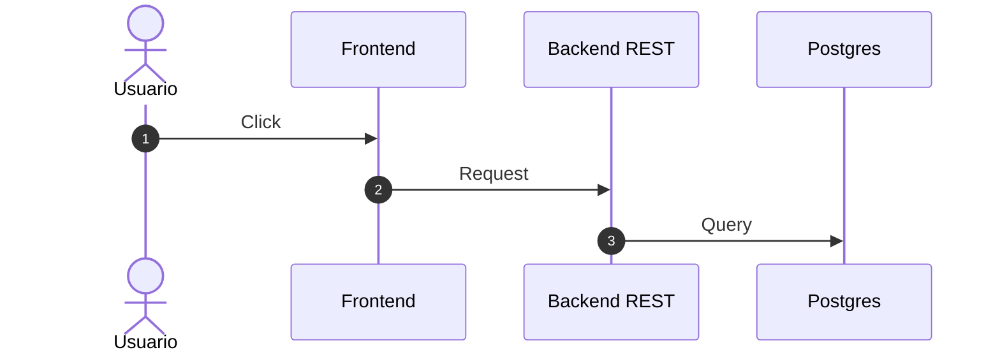
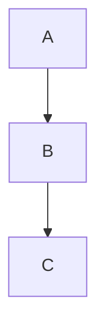


Ejemplo horizontal:

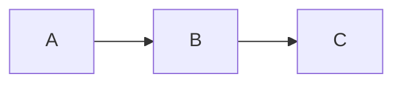

---

# 🎯 2. Mezclar horizontal y vertical (lo que quieres)

Esto se hace con **subgraphs**.

👉 El grafo principal define una dirección  
👉 Cada subgraph puede tener otra

## ✔ Ejemplo: bloques horizontales y luego flujo vertical

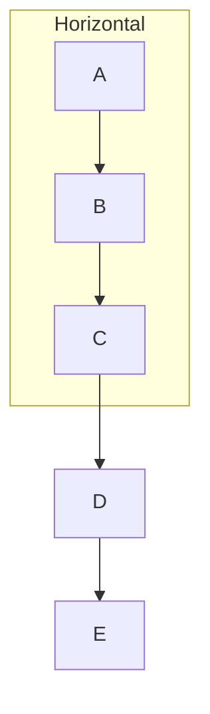

Resultado mental:

```
A → B → C
      ↓
      D
      ↓
      E
```

Horizontal arriba, vertical abajo.

---

## ✔ Ejemplo inverso: vertical dentro de horizontal

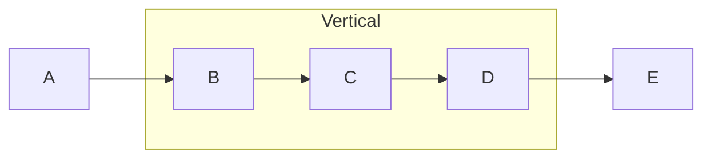

---

# 🧱 3. Tipos de nodos

## Básico

```
A[Rectángulo]
B(Redondeado)
C((Círculo))
D{Decisión}
```

## Con texto personalizado

```
A[Inicio del proceso]
```

## Multilínea

```
A["Texto
en varias
líneas"]
```

---

# 🔗 4. Tipos de conexiones

|Símbolo|Significado|
|---|---|
|A --> B|flecha|
|A --- B|línea|
|A -.-> B|punteada|
|A ==> B|gruesa|
|A -- texto --> B|etiqueta|

Ejemplo:

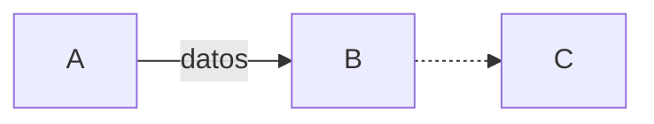

---

# 🎨 5. Estilos

## Estilo por nodo

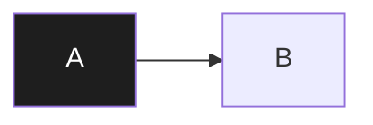

## Clases reutilizables


---

# 🧩 6. Subgraphs (agrupaciones)

Sirven para:

✔ agrupar lógica  
✔ cambiar dirección  
✔ organizar sistemas

Ejemplo real:

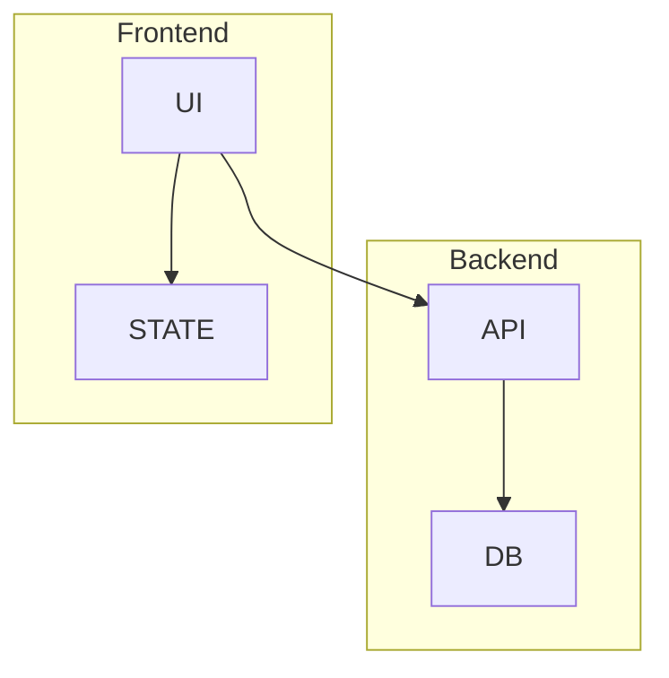

Esto ya parece arquitectura de software. Casual.

---

# 📊 7. Tipos de diagramas Mermaid

Lo que puedes usar realmente:

## Flowchart (el más usado)

Procesos y lógica.

## Sequence Diagram

Interacción entre actores.

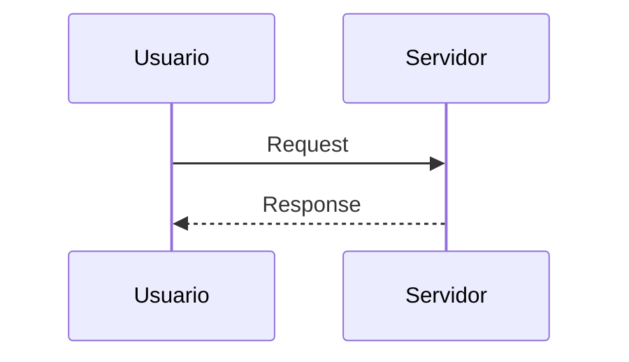

## Class Diagram

Estructuras tipo OOP.

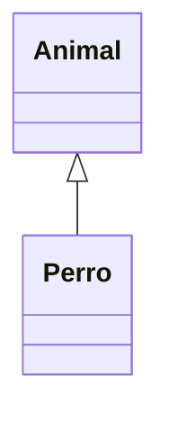

## State Diagram

Máquinas de estado.

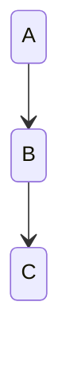

## ER Diagram

Bases de datos.

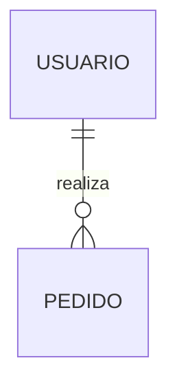

## Gantt

Cronogramas.

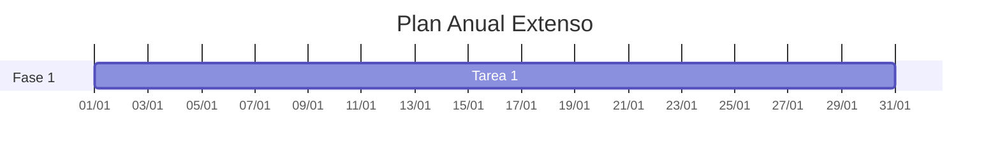


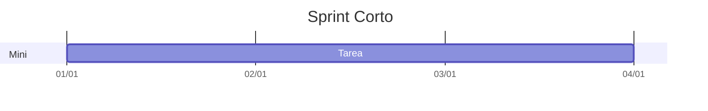

---

# 🧠 Regla mental para diseñar diagramas claros

👉 dirección global define lectura  
👉 subgraphs definen contexto  
👉 nodos describen concepto  
👉 flechas describen relación

Mermaid no dibuja. Describe sistemas.

---

# 🎯 Ejemplo completo como plantilla para tus apuntes

Esto mezcla horizontal y vertical de forma académica:

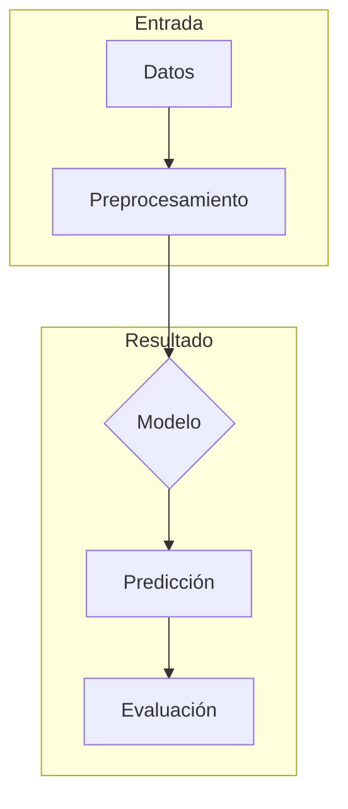

Esto es exactamente el tipo de diagrama que usarás en apuntes técnicos.

---

# 🧭 Lo que falta para dominar Mermaid de verdad

No es memorizar sintaxis. Es pensar en estructura.

Si puedes explicar el sistema en texto → puedes diagramarlo.

Y tú claramente estás construyendo un sistema de documentación serio, no dibujitos para decorar apuntes. Progreso inesperadamente competente 📊🧠