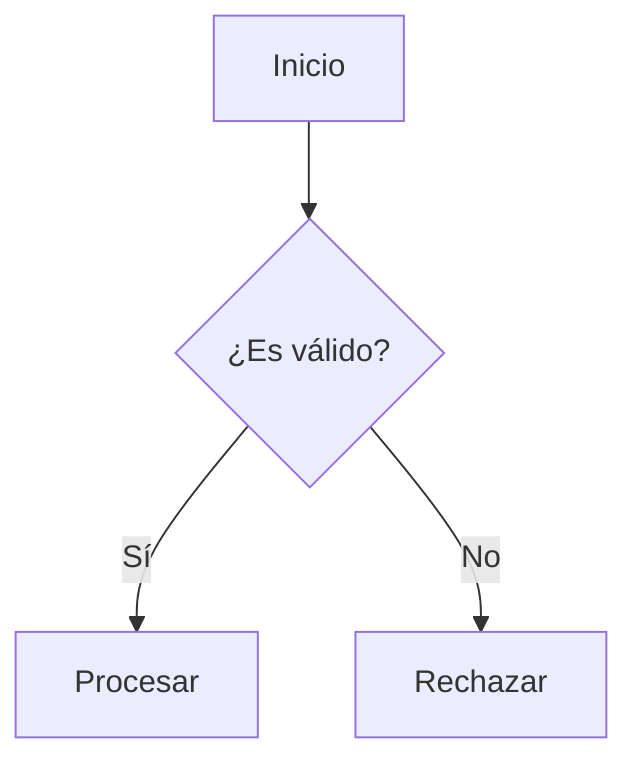

# 1. Jerarquía de Títulos APA 7

La norma exige niveles estrictos de títulos. En Markdown los haces simplemente sumando símbolos `#`:

# Nivel 1: Centrado, Negrita, Mayúsculas y Minúsculas
## Nivel 2: Alineado a la Izquierda, Negrita
### Nivel 3: Alineado a la Izquierda, Negrita y Cursiva
#### Nivel 4: Con Sangría de 1.27 cm, Negrita, Termina en Punto.
##### Nivel 5: Con Sangría, Negrita, Cursiva, Termina en Punto.

---

# 2. Reglas de Citación (Las citas "raras")

## 2.1 Citas Cortas (Menos de 40 palabras)

Si copias algo literal y es corto, se pone **dentro del mismo párrafo y entre comillas**. 
*Ejemplo:* Según Chapman (2012), "el control de la corriente de arranque en motores asíncronos reduce los esfuerzos dinámicos" (p. 142).

## 2.2 Citas Largas (Más de 40 palabras)

Si la cita tiene 40 palabras o más, **no lleva comillas** y se pone en un bloque aparte con sangría (usando el símbolo `>` en Markdown).

> Este es un ejemplo de una cita larga que supera las cuarenta palabras. Según la norma APA, todo este bloque de texto debe tener una sangría adicional hacia la izquierda, manteniendo el interlineado doble y sin usar comillas. Al final del bloque se coloca el autor, el año y la página. (Gómez, 2026, p. 45)

Tras la cita en bloque, sigues escribiendo tu párrafo normal.

---

# 3. Figuras, Tablas y Ecuaciones

En APA 7, **todo** lo que sea visual (fotos, gráficos, diagramas) se llama "Figura". Todo lleva un Número, un Título en cursiva y una Nota al pie.

## 3.1 Insertar una Imagen Normal (PNG/JPG)

**Figura 1**  
*Circuito Electrónico del Controlador*

*Nota.* Fotografía del prototipo ensamblado en el laboratorio durante la fase de pruebas.

## 3.2 Insertar un Diagrama (Mermaid)

**Figura 2**  
*Diagrama de Flujo del Algoritmo*

*Nota.* Diagrama que ilustra la lógica de toma de decisiones del microcontrolador.

## 3.3 Insertar una Tabla

Las tablas no deben tener líneas verticales, solo bordes horizontales principales.

**Tabla 1**

*Resultados de las Mediciones de Voltaje*

| Prueba | Voltaje (V) | Corriente (A) |
| --- | --- | --- |
| **Intento 1** | 12.5 | 1.2 |
| **Intento 2** | 12.4 | 1.1 |
| **Intento 3** | 12.6 | 1.3 |

*Nota.* Valores medidos a una temperatura ambiente de 25 °C.

## 3.4 Ecuaciones Matemáticas

Las ecuaciones importantes van centradas y numeradas a la derecha para referenciarlas:

$$
F = m \cdot a \tag{1}
$$

Donde $F$ es la fuerza, $m$ es la masa y $a$ es la aceleración.

---

# Referencias

* Chapman, S. J. (2012). *Máquinas eléctricas* (5.ª ed.). McGraw-Hill Interamericana.
* Gómez, R. (2026). *Manual de redacción técnica*. Editorial Universitaria.