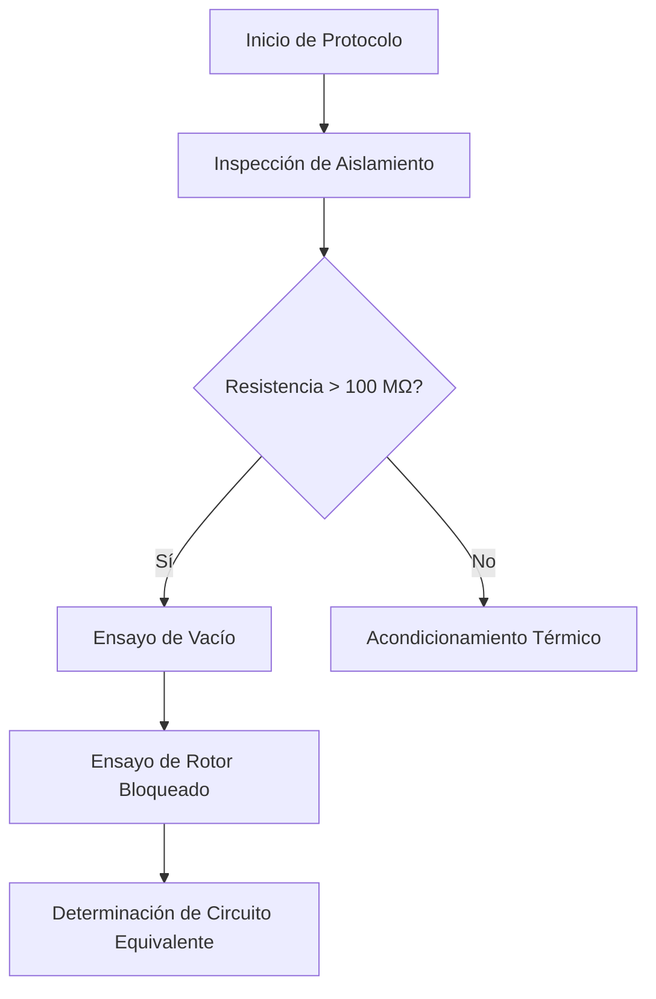

# 1. Formato General del Documento

El formato de las Normas APA (7.ª edición) establece pautas estrictas para la presentación física y digital de trabajos académicos y profesionales. En este sistema de documentación, la conversión entre la lectura en pantalla y la exportación impresa en PDF se realiza de manera automatizada manteniendo la fidelidad visual de la norma.

El tamaño de página oficial es Carta o A4 con márgenes uniformes de 2.54 cm (1 pulgada) aplicados en los cuatro márgenes de la hoja. Cada párrafo regular comienza con una sangría de primera línea equivalente a 1.27 cm (media pulgada), redactado con alineación a la izquierda y espaciado interlineal doble, evitando la justificación completa forzada que genera espaciados irregulares entre palabras.

## 1.1 Jerarquía de Encabezados APA

Las Normas APA definen exactamente cinco niveles jerárquicos para organizar las secciones de un informe técnico. En Markdown, cada nivel se asigna mediante el uso correlativo del símbolo numeral (`#`):

# Título de Nivel 1: Centrado, Negrita, Cada Palabra con Mayúscula Inicial
## Título de Nivel 2: Alineado a la Izquierda, Negrita
### Título de Nivel 3: Alineado a la Izquierda, Negrita y Cursiva
#### Título de Nivel 4: Con Sangría de 1.27 cm, Negrita, Termina en Punto.
##### Título de Nivel 5: Con Sangría de 1.27 cm, Negrita, Cursiva, Termina en Punto.

Los niveles 4 y 5 se redactan en línea con el párrafo que les sigue inmediatamente, tal como estipula la norma de redacción continua.

---

# 2. Reglas Oficiales de Citación

Las citas permiten sustentar empírica y conceptualmente cada afirmación técnica, atribuyendo el mérito a sus autores originales. Se distinguen dos grandes modalidades: citas directas (textuales) y citas indirectas (parafraseadas).

## 2.1 Citas Textuales Menores a 40 Palabras

Cuando la transcripción literal contiene menos de 40 palabras, se incorpora dentro del propio flujo del texto, encerrada entre comillas dobles y con la indicación del autor, año y número de página de procedencia.

Por ejemplo, con énfasis en el autor: Según Chapman (2012), "el control de la corriente de arranque en motores asíncronos reduce drásticamente los esfuerzos dinámicos en los acoplamientos mecánicos" (p. 142). O con énfasis en el texto: "La potencia activa refleja la conversión neta de energía eléctrica en trabajo mecánico útil" (Fitzgerald et al., 2003, p. 88).

## 2.2 Citas Textuales Mayores a 40 Palabras (En Bloque)

Las citas que superan las 40 palabras se separan del texto principal creando un bloque independiente, sin comillas, con una sangría izquierda general de 1.27 cm y a doble espacio. En Markdown se construyen anteponiendo el delimitador `>`:

> El procedimiento de compensación reactiva en redes industriales requiere un análisis armónico previo. Toda inserción masiva de capacitores sin reactores de desintonización puede originar fenómenos de resonancia paralela que sobrecargan los transformadores de potencia y los conductores de alimentación principal. (IEEE, 2018, p. 34)

Tras la cita en bloque, el texto continúa en un nuevo párrafo respetando su sangría normal.

## 2.3 Parafraseo y Múltiples Autores

Al parafrasear se resume la idea con palabras propias. Se cita al autor y año sin requerir obligatoriamente el número de página:
* **Un autor:** Ogata (2010) demostró la estabilidad del sistema mediante el análisis de raíces.
* **Dos autores:** Las mediciones dinamométricas confirman la dispersión magnética (Smith & Jones, 2021).
* **Tres o más autores:** Se utiliza la abreviatura *et al.* desde la primera mención (Gómez et al., 2024).
* **Autor corporativo con sigla:** En la primera cita se indica completo y la sigla: Instituto de Ingenieros Eléctricos y Electrónicos (IEEE, 2018); en las siguientes se emplea únicamente IEEE (2018).

---

# 3. Tablas y Figuras Técnicas

En la 7.ª edición de APA, todo elemento visual se clasifica estrictamente como **Tabla** (matrices de texto y números) o **Figura** (gráficos, diagramas, esquemas, fotografías y mapas).

## 3.1 Tablas bajo Norma APA

Las tablas no deben llevar líneas verticales divisorias. Únicamente se permiten tres bordes horizontales: en el límite superior de la tabla, separando los encabezados de las columnas, y en el límite inferior final.

**Tabla 1**  
*Parámetros Operativos del Motor de Inducción bajo Carga*

| Estado de Carga (%) | Tensión ($V_L$) | Corriente ($I_L$) | Potencia ($kW$) | Factor de Potencia ($\cos\phi$) |
| :--- | :---: | :---: | :---: | :---: |
| **0 % (Vacío)** | 380.0 | 2.15 | 0.18 | 0.13 |
| **50 %** | 379.1 | 3.90 | 2.28 | 0.78 |
| **100 % (Nominal)** | 377.6 | 6.85 | 4.60 | 0.87 |

*Nota.* Datos obtenidos a frecuencia nominal de 60 Hz y temperatura de devanado estabilizada a 75 °C.

## 3.2 Diagramas de Flujo (Mermaid) como Figuras

Los esquemas conceptuales y diagramas de flujo generados vectorialmente se catalogan como figuras. Se rotulan en la parte superior con su numeración y título en cursiva:

**Figura 1**  
*Secuencia de Ensayos Normalizados para Máquinas Rotativas*

*Nota.* Diagrama adaptado del estándar IEEE Std 112-2017 para pruebas en generadores y motores polifásicos.

## 3.3 Ecuaciones Matemáticas con KaTeX

Las ecuaciones display se presentan centradas, identificándolas con un numeral entre paréntesis hacia el margen derecho cuando son referenciadas en el texto:

$$
P_{activa} = \sqrt{3} \cdot V_L \cdot I_L \cdot \cos(\theta) \tag{1}
$$

Donde $V_L$ corresponde a la tensión de línea eficaz, $I_L$ a la corriente de línea del estator y $\theta$ al desfase angular entre tensión y corriente.

---

# 4. Conclusiones

El empleo estricto de las directrices APA 7 garantiza la uniformidad estética y la precisión formal exigida en la redacción de informes y artículos técnicos universitarios. La estructuración modular mediante Markdown asegura que el contenido sea transportable, indexable por herramientas locales y exportable a documentos limpios en formato PDF.

---

# Referencias

* Chapman, S. J. (2012). *Máquinas eléctricas* (5.ª ed.). McGraw-Hill Interamericana.
* Fitzgerald, A. E., Kingsley, C., & Umans, S. D. (2003). *Electric machinery* (6.ª ed.). McGraw-Hill Higher Education.
* Gómez, R., Sánchez, J., & Paredes, O. (2024). *Modelado y compensación reactiva en sistemas de potencia*. Editorial Universitaria UNI.
* Institute of Electrical and Electronics Engineers. (2018). *IEEE Standard Test Procedure for Polyphase Induction Motors and Generators* (IEEE Std 112-2017). IEEE. https://doi.org/10.1109/IEEESTD.2018.8291410
* Ogata, K. (2010). *Ingeniería de control moderna* (5.ª ed.). Pearson Educación.
